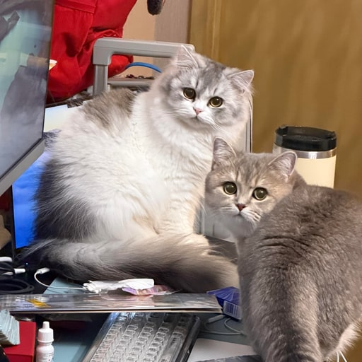

  

<h1 align="center">Frank · <code>@survivorff</code></h1>

  <em>Exchange Engineer · EVM & Solana · Writing in Public · 杭州 Hangzhou</em>

  
  
  

---

### Hey 👋

白天在 crypto 交易所写代码，做交易系统和链上基建，EVM / Solana 双链。
下班之后读书、跑步、看球、做饭、瞎琢磨预测市场。

The cats above are my roommates. They edit all my commits.

---

### What I'm up to

- 🏢 Backend engineer at a crypto exchange — trading systems · on-chain infra
- 🧠 Going deep on Solana and the intersection of Crypto × AI
- ✍️ Writing in public, two flavors:
  - [**blog.frankfu.cloud**](https://blog.frankfu.cloud) — tech, long-form, 中文
  - [**me.frankfu.cloud**](https://me.frankfu.cloud) — 下班之后的生活、读书、旅行、兴趣

---

### Stack

<table>
  <tr>
    <td><b>Languages</b></td>
    <td>
      
      
      
      
      
      
    </td>
  </tr>
  <tr>
    <td><b>Blockchain</b></td>
    <td>
      
      
      
    </td>
  </tr>
  <tr>
    <td><b>AI in Dev Loop</b></td>
    <td>
      
      
      
      
    </td>
  </tr>
  <tr>
    <td><b>Domain</b></td>
    <td>CEX / DEX · MEV · Smart Contracts · Meme Infra · High-Throughput Trading</td>
  </tr>
</table>

---

### Things I'm building

| Repo | What it is |
|---|---|
| 📝 [**blog**](https://github.com/survivorff/blog) | Tech blog source — [blog.frankfu.cloud](https://blog.frankfu.cloud) |
| 🌿 [**me**](https://github.com/survivorff/me) | Personal blog source — [me.frankfu.cloud](https://me.frankfu.cloud) |
| 🐸 [**meme-trade-wiki**](https://github.com/survivorff/meme-trade-wiki) | Reference wiki for Meme trading infrastructure |
| 🔍 [**web3-insider**](https://github.com/survivorff/web3-insider) | Exchange-side breakdowns of on-chain tech |
| 🤖 [**content-os**](https://github.com/survivorff/content-os) | Agent-skills content pipeline: one idea → multi-platform |

---

### Also

- 🏃 Runner with a 6-ish pace, chasing sub-6
- 🎯 [Polymarket](https://polymarket.com/) player — probability changed how I see things
- 📚 Reading across 经管 / 心理 / 技术
- 🎵 Rock, folk, occasional electronic

---

### Activity

  
  

Open to chatting with folks at the intersection of <b>Crypto × AI</b> · or anyone who also runs and reads and overthinks.

